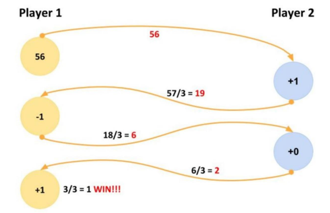

# Description

When a player starts, it sends request to the second whether the second wants to play. 
If second type "yes" a random (whole) number is generated and sends to the
first
player. The receiving player can now
always choose between adding one of {-1, 0, 1} to get to a number that is
divisible by 3. Divide it by three. The resulting whole number is then sent back
to the original sender.
The same rules are applied until one player reaches the number 1(after the
division). See the example below.

## How it works

Please run 2 instances of this service(profile player1 and player2), which represent 2 independent units for two players.

When player1 wants to start the game they trigger POST request http://localhost:8082/game/start. This endpoint triggers player2 instance and asks in console whether player2 wants to start a game. If player types "Yes" - the game is started. For manual input player should type "M" in console, otherwise the game will be played automatically.

When player2 wants to start the game they trigger POST request http://localhost:8081/game/start. The other functionality works the same.

For the successful game two instances should be up and running.

## Instructions

Install and configure Java 21 and Maven 3.9 or higher. Install Docker Desktop.

1. Start the docker-compose: `docker-compose up` - kafka will be available on http://localhost:8090/overview
2. Run the application for player 1: `./mvnw spring-boot:run -Dspring-boot.run.profiles=player1`
3. Run the application for player 2: `./mvnw spring-boot:run -Dspring-boot.run.profiles=player2`
4. Run the tests: `mvn test`
5. Kafka (and a producer/consumer example class)
- You can access the RedPanda console under: http://localhost:8090